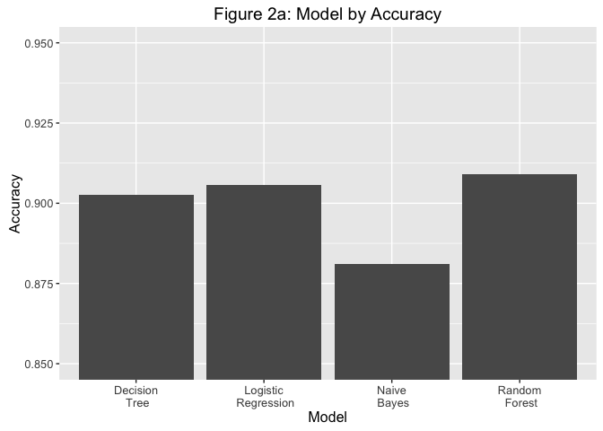

Identifying Bank Telemarketing Market Segmentation Using Classification Algorithms
================
by Davin Kaing, Pinkaew Choengtawee, Jiating Chen, Hanbo Li
January 1, 2017

Abstract
========

The objective of our project is to identify the market segment that maximizes business value for bank telemarketing campaign. To do this, we built predictive models using: Logistic Regression, Naive Bayes, Random Forest, and Decision Tree. From our analysis, Random Forest yielded the most accuracy in our prediction. We then chose this model to further explore the features that have the most impact in our model. The top four important variables from this model are: Duration, Month, Balance and Age. Using these important features, we provided business recommendations on how to target the market that maximizes revenue. We then calculated that the market with our recommended approach can potentially increase the success rate by 40%.

Methodology
===========

The following enumerates our methodology. Each step will be discussed in detail in the subsections below.

1.  Data Exploratory Analysis
2.  Model Selection
3.  Important Variables Selection
4.  Business Recommendation
5.  Business Value Quantification

Exploratory Analysis
====================

In the exploratory analysis, we extracted 30% data of our dataset as a small sample and used Random forest algorithm to detect some likely important independent variables.

From the result, some top variables may be important to the response, such as ‘Duration’, ‘Month’, ‘Balance’, ‘Age’ and ‘Day’ as shown in Figure 1. Although "Duration", which represents the duration of the call, is the most important variable, our team thinks that this can be a confounding variable. Our reasoning is that the duration of the call is driven by the interests of the consumer and we do not think that the duration of the call can drive the interests of the consumer. Further interpretation of this relationship is discussed later in the report.

Model Selection
===============

We used four different algorithms: Naive Bayes, Decision Tree, Logistic Regression, and Random Forest to build four predictive models and did a comparative study of them in terms of their accuracy and efficiency. The efficiency was measured by CPU-time in seconds. As shown in Figure 2, Random Forest had the highest accuracy, followed by Logistic Regression, Decision Tree, and Naive Bayes. However, when we examined efficiency, Random Forest also appeared to be the most computationally expensive in comparison to the other models.

According to the ROC curve (Figure 3) of 4 different models, Random Forest model has the best performance. With this information, we then used Random Forest model to drive our business recommendation.

Important Variables Selection
=============================

Given that the Random Forest model yields the highest performance, we decided to use this model to drive our business recommendations. To do that, we plotted important variables (from the Random Forest model) according to the mean decrease Gini. From the graph below you can see that the most important variable is duration, followed by month, balance, age and so forth.

    ## Warning: Removed 6611 rows containing non-finite values (stat_boxplot).

Business Recommendations
========================

After we identified the most important variables, we generated several recommendations from the perspective of the business, which are banks or financial institutions in our case. Below are our recommendations:

1.  Train the sale representatives to talk longer than 14 minutes (calculated from our model) with the potential customers.

2.  Hire more people or conduct intensive bank telemarketing campaigns in the following months: March, August, November and December.

3.  Target the age group below 20 and above 60 years old because they are the people who are more likely to respond “yes”.

One thing worth mentioning is that from the perspective of business, they cannot do anything with potential customers’ balance in their bank account. That’s why we didn’t generate recommendations for this variable.

Business Value Quantification
=============================

Given our recommendations, we are also interested in quantifying the potential increase in business value. We can do this by quantifying the increase in success ratio if our recommendations are implemented (the success ratio is an accurate indicator of business value because for each “yes” response, a quantity of revenue generated. Hence, the success ratio is directly proportional to revenue). To calculate the success ratio given our recommendation, we subset the data according to our business recommendations: the duration is greater than 14 minutes; the months are March, August, November, December; and the age is below 20 and greater than 60. With this subsetted data, we computed the success ratio to be 50% (See Figure 9). As shown in Figure 9, the success ratio increases by approximately 40%. In other words, the revenue can be increased by 4 times if the recommendation is implemented. However, this is under the assumption that the new targeted population, following our recommendation, is representative of the subset population.

Limitation & Future Study
=========================

The biggest limitation of our analysis is that the “duration” variable can be a confounding variable. The “duration” variable represents the length of the calls. When we examined the most important variables, “duration” is the most important variable. However, our group thinks that “duration” may not influence the successful responses in the marketing response, rather, we think that the interests of the consumers influence the length of the call, and henceforth, causing the duration to be longer for those who are interested in the product and are willing to respond “yes” to the product. With this limitation, we think that future study should delve into the relationship between the duration of the call and the responses. One way to do this is to gather recorded call data (if available), and quantify the consumers’ interest by word choice. We can then use this variable to find a correlation between duration and response. Another possible study is to conduct an experiment where subjects are required to speak to a bank teller for a certain period of time and a survey can be conducted post-experiment to measure their interest in the product.

Conclusion
==========

Our team used the most accurate classification algorithm to drive the business recommendations. Random Forest provides the most accurate result in comparison to the four classification algorithms. From this model, we then selected the most important variables - Duration, Month, Balance, and Age. We then provided a recommendation to target the market that can generate more revenue. The quantification of this increase is measured by the increased success ratio with the recommendation approach. This increase is calculated to be 40%.

References
==========

Arvin Fouladifar, E. T. (2016). Market Segmentation for Marketing of Banking Industry Products Constructing a Clustering Model for Bank Pasargad's E-banking Customers Using RFM Technique and K-Means Algorithm. Medwell Journals.

Moro, S., Cortez, P., and Rita, P. (2014) “A Data-Driven Approach to Predict the Success of Bank Telemarketing.” Decision Support Systems. Elsevier. 62:22-31

Mehrotra, A., Agarwal, R. (2009) “Classifying customers on the basis of their attitudes towards telemarketing.” Journal of Targeting, Measurement and Analysis for Marketing. Vol. 17, 3, 171-193

Moro, S., Cortez, P., Laureano, R., (2013) “A Data Mining Approach for Bank Telemarketing Using the rminer Package and R Tool.” ISCTE-IUL, Business Research Unite (BRU-IUL)

Moro S., Laureano R. and Cortez P., (2011) “Using Data Mining for Bank Direct Marketing: An Application of the CRISP-DM Methodology.” In P. Novais et al. (Eds.), Proceedings of the European Simulation and Modelling Conference - ESM'2011, pp. 117-121, Guimaraes, Portugal

Smith, W. R. (1995, December). Product Differentiation and Market Segmentation as Alternative Marketing Strategies. Marketing Management, 4(3), p. 64.
